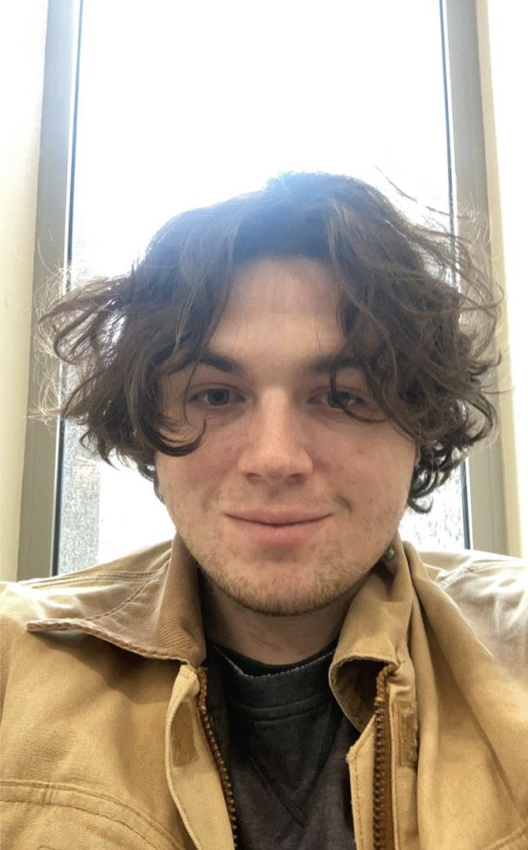

# Dan Constance

## For my computer experience, this should be my second to last semester in college for Computer Science, and after this I have to take only a Projects course in Fall. I’ve taken CS1, CS2, CS3, Lang Proc, Web Page Design, Assembly, Object Oriented Programming, OS, Software Engineering, and probably some other stuff I can’t remember off the top of my head. I’ve created a few websites before for baseball teams, but they don’t really have much backend and are primarily just front-end websites. In Software Engineering, me and my group made an educational game where you take photos of animals to learn about them. I also do small projects for friends sometimes, like a Discord bot for fake gambling and stuff like that for fun.

## I see myself using what I learn in this course to help upgrade the websites I’ve been making so they aren’t just front-end but actually completely full-stack. I can also use it in the future for web development jobs that may interest me, so Im really looking forward to this class.